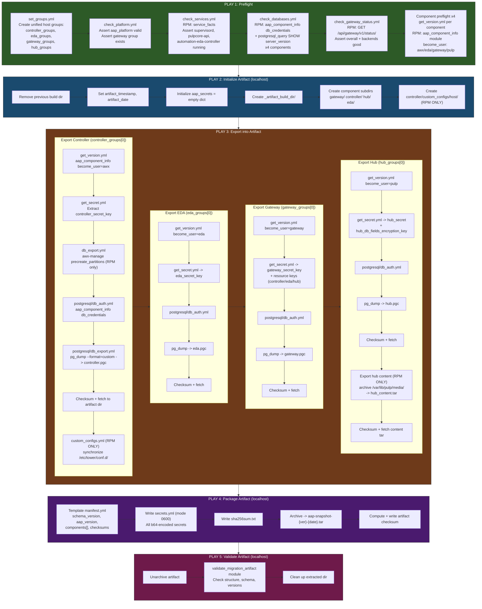

# AAP Snapshot Collection Flow Diagrams

## RPM Export Flow



### RPM Export Artifact Output

```
aap-snapshot-{version}-{timestamp}.tar
 +-- manifest.yml
 +-- secrets.yml (0600)
 +-- sha256sum.txt
 +-- controller/
 |    +-- controller.pgc
 |    +-- custom_configs/{hostname}/   <-- RPM only
 +-- eda/
 |    +-- eda.pgc
 +-- gateway/
 |    +-- gateway.pgc
 +-- hub/
      +-- hub.pgc
      +-- hub_content.tar              <-- when export_hub_content=true
```

---

## OCP Import Flow

```mermaid
flowchart TD
    subgraph PLAY1["PLAY 1: Preflight (OCP)"]
        A1[set_groups.yml<br/>Create unified host groups]
        A2[check_platform.yml<br/>Assert aap_platform valid]
        A3["check_ocp_target.yml (OCP ONLY)<br/>Verify namespace exists<br/>Verify AAP CRD installed"]
        A4["check_aap_cr.yml (OCP ONLY)<br/>Query AnsibleAutomationPlatform CR<br/>Assert no Failure conditions"]
        A5["discover_components.yml<br/>Find all pods, CRs, Route<br/>Set _*_pod_name facts"]
        A6["check_services.yml (OCP)<br/>Assert no pods in CrashLoopBackOff"]
        A7["check_databases.yml (OCP)<br/>k8s_exec: manage check --database<br/>in each component pod"]
        A8["check_gateway_status.yml (OCP)<br/>k8s_exec: curl gateway status<br/>inside gateway pod"]
        A9[Component preflight x4<br/>get_version.yml via k8s_exec<br/>manage shell in each component pod]

        A1 --> A2 --> A3 --> A4 --> A5 --> A6 --> A7 --> A8 --> A9
    end

    subgraph PLAY2["PLAY 2: Validate & Extract (localhost)"]
        B1[Unarchive artifact tarball]
        B2[validate_migration_artifact module]
        B3[Load secrets.yml -> artifact_secrets]
        B4[Load manifest.yml -> artifact_manifest]

        B1 --> B2 --> B3 --> B4
    end

    subgraph PLAY3["PLAY 3: Import (OCP) -- block/always"]
        subgraph PREIMPORT["Pre-Import Checks"]
            C1["check_version_match.yml<br/>Query ClusterServiceVersion<br/>Assert AAP version matches artifact"]
            C2{"AAP CR<br/>exists?"}
            C3["check_storage_class.yml<br/>Verify RWX StorageClass for Hub"]
            C4["create_aap_cr.yml<br/>Seed encryption secrets from artifact<br/>Create AnsibleAutomationPlatform CR"]
            C5["wait_aap_ready.yml<br/>Poll CR status -> Successful<br/>(40min timeout)"]

            C1 --> C2
            C2 -->|No| C3 --> C4 --> C5
            C2 -->|Yes| C6
        end

        subgraph QUIESCE["Quiesce Environment"]
            C6["idle_aap.yml (idle=true)<br/>Patch CR: spec.idle_aap=true<br/>Wait for non-DB pods to terminate"]
            C7["scale_operators.yml (replicas=0)<br/>Scale gateway + controller operators to 0"]

            C6 --> C7
        end

        subgraph STAGE["Stage Artifact"]
            C8["create_temp_resources.yml<br/>Create PVC: aap-snapshot-temp (60Gi)<br/>Create Deployment: postgresql-15 pod<br/>sleep infinity"]
            C9["transfer_artifact.yml<br/>k8s_cp artifact -> /tmp/migration/<br/>tar xf inside pod"]

            C8 --> C9
        end

        subgraph RESTORE["Restore Databases (per component)"]
            D1["import_controller<br/>Read K8s Secret: aap-controller-postgres-configuration<br/>Find postgres pod: aap-postgres-15-0<br/>GRANT CREATEDB via k8s_exec on PG pod<br/>pg_restore via k8s_exec on TEMP pod<br/>REVOKE CREATEDB<br/>Patch aap-controller-secret-key"]
            D2["import_hub<br/>Same pattern with hub credentials<br/>Patch aap-hub-db-fields-encryption<br/>+ aap-hub-secret-key"]
            D3["import_gateway<br/>Same pattern with gateway credentials<br/>Patch aap-db-fields-encryption-secret"]
            D4["import_eda<br/>Same pattern with eda credentials<br/>Patch aap-eda-secret-key"]

            D1 --> D2 --> D3 --> D4
        end

        subgraph RESUME["Resume Environment"]
            E1["scale_operators.yml (replicas=1)<br/>Scale operators back to 1<br/>Wait for readyReplicas"]
            E2["idle_aap.yml (idle=false)<br/>Patch CR: spec.idle_aap=false<br/>Wait for gateway pod Running"]
            E3["wait_aap_ready.yml<br/>Poll CR status -> Successful<br/>(40min timeout)"]
            E4["discover_components.yml<br/>Re-discover all pods + CRs"]

            E1 --> E2 --> E3 --> E4
        end

        subgraph RECONCILE["Post-Import Reconciliation"]
            F1["reconcile_gateway<br/>aap-gateway-manage migrate<br/>Delete HTTPPort, Route, ServiceNode,<br/>ServiceCluster objects<br/>Delete aap-resource-server secret"]
            F2["reconcile_controller<br/>Find instances w/ stale heartbeats<br/>deprovision_instance per orphan"]
            F3["reconcile_hub<br/>pulpcore-manager repair-artifacts"]
            F4["reconcile_eda<br/>aap-eda-manage resource_sync"]

            F1 --> F2 --> F3 --> F4
        end

        PREIMPORT --> QUIESCE --> STAGE --> RESTORE --> RESUME --> RECONCILE

        subgraph ALWAYS["ALWAYS: Cleanup"]
            G1["cleanup_temp_resources.yml<br/>Delete aap-snapshot-temp-postgres Deployment<br/>Delete aap-snapshot-temp PVC"]
        end
    end

    subgraph PLAY7["PLAY 7: Post-Import Report (localhost)"]
        H1["Migration summary<br/>Source topology, target platform,<br/>AAP version, components migrated"]
        H2["Post-import advisory<br/>Verify admin creds, instance groups,<br/>EDA controller URL, execution nodes,<br/>hub content sync, TLS certs"]

        H1 --> H2
    end

    PLAY1 --> PLAY2 --> PLAY3 --> PLAY7
    PLAY3 -.->|always| ALWAYS

    style PLAY1 fill:#2d5a27,stroke:#333,color:#fff
    style PLAY2 fill:#1a4a6e,stroke:#333,color:#fff
    style PLAY3 fill:#6e3a1a,stroke:#333,color:#fff
    style PREIMPORT fill:#4a3a1a,stroke:#555,color:#fff
    style QUIESCE fill:#6e4a1a,stroke:#555,color:#fff
    style STAGE fill:#7e5a2a,stroke:#555,color:#fff
    style RESTORE fill:#8e3a1a,stroke:#555,color:#fff
    style RESUME fill:#5e6a1a,stroke:#555,color:#fff
    style RECONCILE fill:#3a5a3a,stroke:#555,color:#fff
    style ALWAYS fill:#6e1a1a,stroke:#555,color:#fff
    style PLAY7 fill:#4a1a6e,stroke:#333,color:#fff
```



### OCP Import: Database Restore Architecture

```
+---------------------------+          +---------------------------+
|   Ansible Controller      |          |   OCP Namespace (aap)     |
|   (localhost)              |          |                           |
|                            |  k8s_cp |  +---------------------+  |
|  artifact.tar  ---------->|--------->|  | aap-snapshot-temp    |  |
|                            |          |  | (postgresql-15 pod)  |  |
|                            |          |  |                     |  |
|                            |          |  | /tmp/migration/     |  |
|                            |          |  |   artifact/         |  |
|                            | k8s_exec|  |     controller.pgc  |  |
|                            |--------->|  |     eda.pgc         |  |
|                            |          |  |     gateway.pgc     |  |
|                            |          |  |     hub.pgc         |  |
|                            |          |  |                     |  |
|                            |          |  | pg_restore ------+  |  |
|                            |          |  +---------------------+  |
|                            |          |                      |    |
|                            |          |              cluster  |    |
|                            |          |              network  |    |
|                            |          |                      v    |
|                            |          |  +---------------------+  |
|                            |          |  | aap-postgres-15-0   |  |
|                            |          |  | (StatefulSet pod)   |  |
|                            |          |  |                     |  |
|                            |          |  | PostgreSQL server   |  |
|                            |          |  | - controller DB     |  |
|                            |          |  | - eda DB            |  |
|                            |          |  | - gateway DB        |  |
|                            |          |  | - hub DB            |  |
|                            |          |  +---------------------+  |
+---------------------------+          +---------------------------+
```

### Key: RPM become_user per Component

| Component  | become_user | manage command      | Service checked              |
|------------|-------------|---------------------|------------------------------|
| Controller | `awx`       | `awx-manage`        | `supervisord.service`        |
| EDA        | `eda`       | `aap-eda-manage`    | `automation-eda-controller`  |
| Gateway    | `gateway`   | `aap-gateway-manage`| `supervisord.service`        |
| Hub        | `pulp`      | `pulpcore-manager`  | `pulpcore-api.service`       |

### Key: OCP K8s Secrets per Component

| Component  | DB Credentials Secret                  | Encryption Secret                   |
|------------|----------------------------------------|-------------------------------------|
| Controller | `aap-controller-postgres-configuration`| `aap-controller-secret-key`         |
| EDA        | `aap-eda-postgres-configuration`       | `aap-eda-secret-key`                |
| Gateway    | `aap-gateway-postgres-configuration`   | `aap-db-fields-encryption-secret`   |
| Hub        | `aap-hub-postgres-configuration`       | `aap-hub-db-fields-encryption` + `aap-hub-secret-key` |
