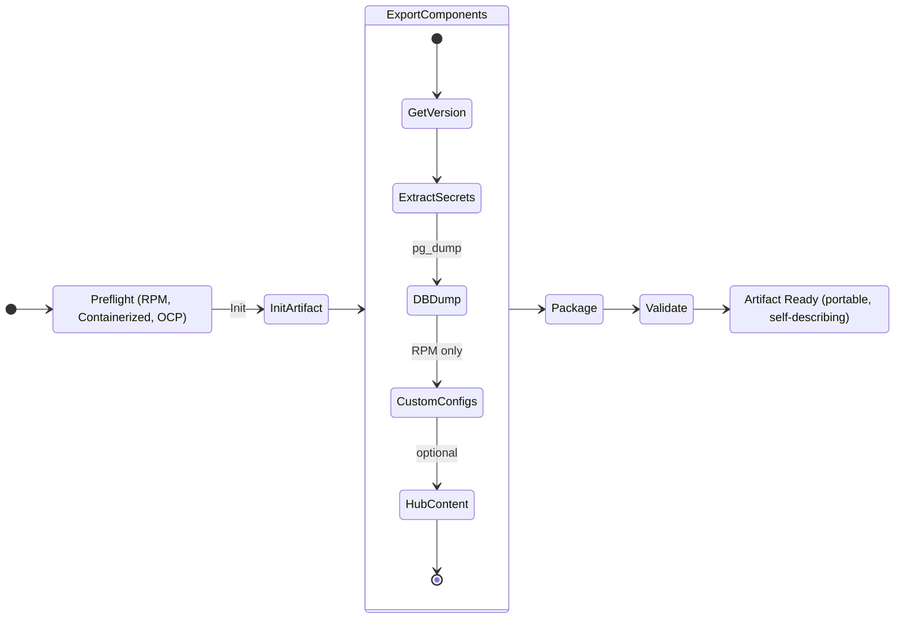
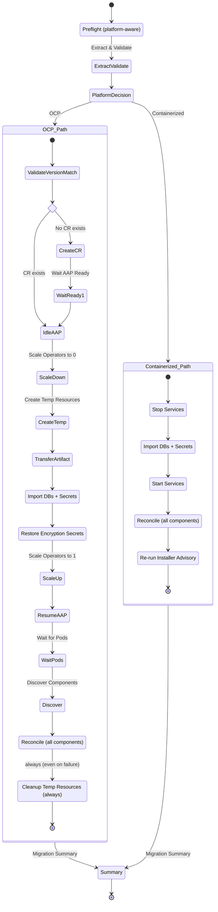

# AAP Migration - Flow Design and User Experience

Complete flow design for the `ansible.aap_snapshot` collection covering the
export-to-import lifecycle, user journey, decision points, error handling,
and recovery paths.

## High-Level Pipeline

```
 SOURCE (RPM / Containerized / OCP)          TARGET (Containerized / OCP)
 +----------------------------------+        +------------------------------+
 |  1. Preflight                    |        |  1. Preflight                |
 |  2. Initialize artifact          |        |  2. Extract & validate       |
 |  3. Export components            |        |  3. Quiesce target           |
 |     - version, secrets, DB dump  |        |  4. Import DB + secrets      |
 |     - custom configs (RPM)       |        |  5. Resume target            |
 |     - hub content (optional)     |        |  6. Reconcile components     |
 |  4. Package + checksum           |        |  7. Post-import advisory     |
 |  5. Validate artifact            |        |                              |
 +---------------+------------------+        +---------------+--------------+
                 |                                           |
                 +--------  artifact.tar  ------------------+
```

## Export Flow

Supported source platforms: RPM, Containerized, OCP



### What the user runs

```bash
# RPM or Containerized - requires inventory with component hosts
ansible-playbook ansible.aap_snapshot.artifact_export \
  -i inventory.yml \
  -e aap_platform=rpm

# OCP - runs against localhost, uses kubeconfig
ansible-playbook ansible.aap_snapshot.artifact_export \
  -e aap_platform=operator \
  -e ocp_namespace=aap
```

### What the user sees

| Phase | Output |
|-------|--------|
| Preflight | Platform validation, component discovery, version detection |
| Initialize | "Created artifact build directory" |
| Export (per component) | Version detected, secrets extracted, DB dump progress |
| Package | Artifact filename, checksum, file size |
| Validate | Validation report (components, versions, checksums) |

### Export decision points

- **Hub content**: set `export_hub_content: false` to skip Pulp content data
  (saves significant time and disk for large hub deployments)
- **Component selection**: only components present in inventory are exported;
  omit a group to skip that component

### Export error states

| Failure Point | What Happens | Recovery |
|---------------|-------------|----------|
| Preflight - platform invalid | Immediate fail with message | Fix `aap_platform` value |
| Preflight - component unreachable | Fail with host/port details | Verify connectivity |
| DB dump | Fail on the component host | Check PostgreSQL service, disk space |
| Package | Fail writing archive | Check disk space on control node |
| Validate | Fail with validation report | Re-run export (non-destructive) |

Export is fully non-destructive - safe to re-run at any time.

---

## Import Flow

Supported target platforms: Containerized, OCP



### What the user runs

```bash
# OCP import - namespace-scoped operator
ansible-playbook ansible.aap_snapshot.artifact_import \
  -e aap_platform=operator \
  -e ocp_namespace=aap \
  -e artifact_file=/path/to/artifact.tar

# OCP import - cluster-scoped operator
ansible-playbook ansible.aap_snapshot.artifact_import \
  -e aap_platform=operator \
  -e ocp_namespace=aap \
  -e operator_namespace=openshift-operators \
  -e artifact_file=/path/to/artifact.tar

# Containerized import
ansible-playbook ansible.aap_snapshot.artifact_import \
  -i inventory.yml \
  -e aap_platform=containerized \
  -e artifact_file=/path/to/artifact.tar
```

### What the user sees

| Phase | Output |
|-------|--------|
| Preflight | Platform check, artifact file check, CR health, idle state check |
| Extract & Validate | Validation report, manifest details, component list |
| Version Match (OCP) | Source vs target version comparison |
| Create CR (OCP, fresh NS) | CR created, waiting for AAP Ready condition |
| Idle AAP (OCP) | Pods terminating, waiting for shutdown |
| Scale Operators (OCP) | Operator replicas set to 0 |
| Create Temp Resources (OCP) | PVC + PostgreSQL pod created |
| Transfer Artifact (OCP) | Artifact copied to temp pod, extracted |
| Import DBs | Per-component pg_restore progress |
| Restore Secrets (OCP) | Encryption secrets patched into K8s Secrets |
| Resume (OCP) | Operators scaled up, AAP un-idled, pods starting |
| Reconcile | Per-component: migrations, password reset, cleanup, repair |
| Summary | Component list, source/target info, next steps advisory |

### OCP import - user journey step by step

1. **Prerequisites**: AAP operator installed, kubeconfig configured, artifact
   file accessible on the control node
2. **Run the playbook** with required variables
3. **Preflight validates** the environment: artifact exists, CR health, not
   already idled from a previous failed run
4. **Artifact extracted and validated** - user sees which components will be
   imported and source version
5. **Version match check** - fails immediately if source and target AAP
   versions differ
6. **Fresh namespace path** (no CR): collection creates the AAP CR from
   artifact metadata and waits for the operator to deploy all components
7. **Existing CR path**: AAP is idled (`spec.idle_aap: true`), pods terminate
8. **Operators scaled to zero** to prevent interference during DB restore
9. **Temp resources created** - PVC and PostgreSQL pod for DB restore
10. **Artifact transferred** to the temp pod
11. **Databases restored** per component via `pg_restore`
12. **Encryption secrets** patched from artifact into K8s Secrets
13. **Operators scaled back up**, AAP un-idled, pods restart
14. **Reconcile** runs per component: schema migrations, admin password reset
    to match K8s secrets, orphan cleanup, content repair
15. **Temp resources cleaned up** (always, even on failure)
16. **Summary and advisory** - migration complete, next steps listed

### Import decision points

| Decision | Variable | Default | When to Override |
|----------|----------|---------|------------------|
| Artifact location | `artifact_file` | (required) | Path to the exported artifact archive |
| Target namespace | `ocp_namespace` | `aap` | Non-default namespace |
| Operator namespace | `operator_namespace` | `{{ ocp_namespace }}` | Cluster-scoped operators in `openshift-operators` |
| Keep temp on failure | `keep_temp_on_failure` | `true` | Set `false` to auto-cleanup on failure |
| Temp PVC size | `temp_pvc_size` | `60Gi` | Storage-constrained clusters (set to 2x artifact size) |

---

## Preflight Validation Gates

Preflight runs before any destructive operation. Checks are ordered from
cheapest to most expensive.

| Check | Scope | Fails When |
|-------|-------|------------|
| Platform valid | all | `aap_platform` not in `[rpm, containerized, operator]` |
| Gateway group exists | RPM, containerized | No hosts in `gateway_groups` |
| Artifact file exists | import only | `artifact_file` path does not exist |
| Namespace exists | OCP | Target namespace not found |
| AAP CRD installed | OCP | Operator not installed on cluster |
| AAP CR exists | OCP import | No CR and no fresh-namespace flow |
| CR not already idled | OCP import | `idle_aap: true` from previous failed run |
| CR conditions healthy | OCP | AAP CR has Failure conditions |
| Component services running | all | Pods in CrashLoopBackOff or Error |
| Database connectivity | RPM, containerized | Cannot connect to component databases |
| Gateway API healthy | RPM, containerized | Gateway status API returns unhealthy backends |
| Version match | OCP import | Source and target AAP versions differ |

---

## Reconcile Details

Post-import reconciliation runs per component to fix state inconsistencies
between the source and target environments.

| Component | Steps | Why |
|-----------|-------|-----|
| Gateway | Schema migrations, reset admin password, delete vestigial objects (HTTPPort, ServiceNode, ServiceCluster, Route), remove resource server secret | Source topology objects reference old infrastructure |
| Controller | Find orphaned instances (heartbeat > 600s), deprovision each | Source instances will never heartbeat again |
| Hub | Pulp content repair (verify checksums, restore integrity) | DB restore may leave content references inconsistent |
| EDA | Resource sync | Reconcile EDA internal state with restored database |
| All (OCP) | Reset admin password to match per-component K8s secret | DB has source environment's password hash; operator manages passwords via secrets |

---

## Error States and Recovery

### OCP Import Failures

The OCP import is wrapped in a `block/always` structure. On any failure:

1. Operators are scaled back to 1 (recovery block)
2. AAP is un-idled (recovery block)
3. Temp resources are cleaned up (unless `keep_temp_on_failure: true`)

| Failure Point | Cluster State | Recovery |
|---------------|---------------|----------|
| Preflight - artifact missing | No changes made | Fix path, re-run |
| Preflight - CR already idled | No changes made | `oc patch aap/<name> -n <ns> --type merge -p '{"spec":{"idle_aap": false}}'`, wait for pods, re-run |
| Preflight - version mismatch | No changes made | Export from matching version or deploy matching operator |
| Idle AAP | AAP idled, no other changes | `always` block un-idles automatically |
| Scale operators | Operators at 0 | `always` block scales back to 1 |
| Transfer artifact | Temp resources exist, AAP idled | `always` block restores; temp PVC available for debugging |
| DB restore (partial) | Some DBs restored, some not | `always` block restores AAP; re-run import (pg_restore is idempotent with `--clean --if-exists`) |
| Reconcile | DBs imported, reconcile incomplete | `always` block runs; re-run import to retry reconcile |

### Containerized Import Failures

| Failure Point | System State | Recovery |
|---------------|-------------|----------|
| Stop services | Services partially stopped | Start services manually, re-run |
| DB restore | Some DBs restored | Start services, re-run import |
| Start services | Services may not start cleanly | Check service logs, re-run containerized installer |
| Reconcile | Services running, reconcile incomplete | Re-run import to retry reconcile |

---

## Post-Import Next Steps

The migration summary advisory tells the user:

1. Verify admin credentials and login to the gateway UI
2. Check instance group assignments - restored resources may need reassignment
3. EDA: update automation controller URL in credentials if hostnames changed
4. Execution nodes: register equivalent nodes in target controller UI
5. Hub content: if not migrated, run content sync manually
6. Review custom TLS certificates and reapply if needed
7. Containerized only: re-run the containerized installer to fully reconcile
   configuration files, TLS certificates, and systemd units
